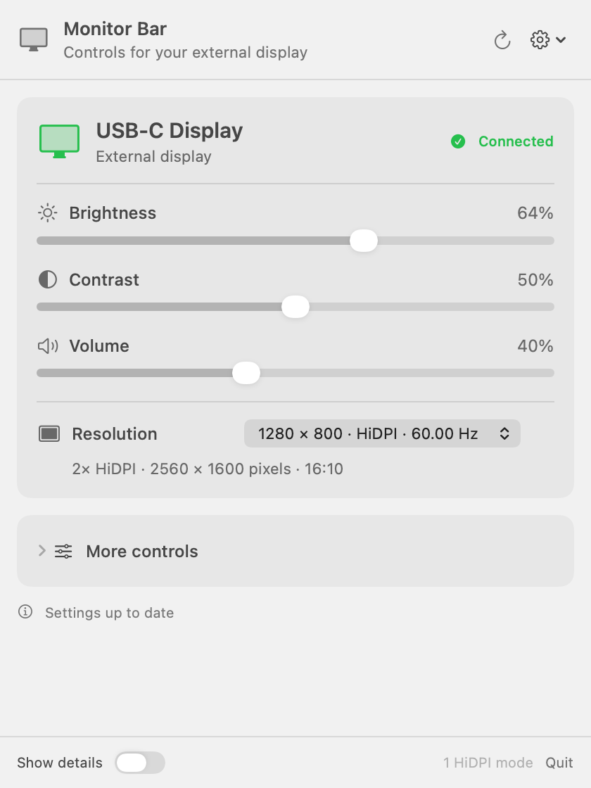

# Monitor Bar

The controls on the back of a monitor are rarely its best feature. Monitor Bar puts brightness, contrast, volume, and display modes in the Mac menu bar, where they're easier to reach.

It's a small, free macOS app built with SwiftUI and AppKit. No account or subscription. The source is available under the [MIT license](LICENSE).

**[Download v0.1.0](https://github.com/aiden0rchad/monitor-bar/releases/tag/v0.1.0)** · **[Documentation](https://aiden0rchad.github.io/monitor-bar/)** · **[Report a problem](https://github.com/aiden0rchad/monitor-bar/issues/new/choose)**

<picture>
  <source media="(prefers-color-scheme: dark)" srcset="docs/assets/monitor-panel-dark.png">
  
</picture>

*The app's actual panel, rendered with sample display data.*

## Install

1. Download **Monitor-Bar-0.1.0-arm64.zip** from the [release page](https://github.com/aiden0rchad/monitor-bar/releases/tag/v0.1.0).
2. Unzip it and move **Monitor Bar.app** to Applications.
3. Open it, then click the monitor icon in the menu bar. There isn't a Dock window to look for.

You'll need an **Apple Silicon Mac running macOS 13 or later**. Hardware controls also need a monitor and cable connection that pass DDC/CI commands. A USB-C connector by itself doesn't guarantee support.

This first release is ad-hoc signed, **not notarized by Apple**. If macOS blocks it, attempt to open it once, then use **System Settings → Privacy & Security → Open Anyway** if you choose to trust it. Apple's [instructions for opening downloaded apps](https://support.apple.com/en-us/102445) explain the prompts. You can also build from source below.

The release includes `SHA256SUMS` so you can check the download:

```sh
shasum -a 256 -c SHA256SUMS
```

Run that from the folder containing both the ZIP and `SHA256SUMS`.

## What it does

- Adjusts hardware brightness, contrast, and volume when the monitor supports them.
- Offers separate brightness and contrast calibration for monitors with odd control ranges.
- Lists the modes macOS exposes, with HiDPI labels, refresh rates, rendering pixels, and aspect ratios.
- Previews a resolution change for 15 seconds. Keep it, or let it revert.
- Exposes supported color settings, inputs, and standby under **More controls**.
- Provides software dimming when you want to darken the image further.
- Shows EDID and DDC details, and exports a local diagnostic report.
- Can launch at login. Use the gear menu to turn that on.

Unsupported controls stay unavailable. The app doesn't invent settings from the monitor's marketing specs.

## A note about brightness and contrast

This project started with a generic USB-C display that reported a normal 0–100 brightness range. In practice, moving through that range made the screen get brighter, then darker, then brighter again. The number returned by the monitor was correct; the picture wasn't behaving like that number suggested.

The working brightness range on that screen was roughly **0–25**. Calibration maps the full slider onto that smaller range. Contrast has an independent calibration for the same kind of problem.

Open **More controls → Brightness calibration** or **Contrast calibration**, enable **Use custom range**, and set the maximum hardware value. A maximum of 25 gives 26 hardware levels, shown in roughly 4% steps. If the control starts reversing near the top, lower the endpoint a little.

**Fresh installs use the monitor's advertised range.** The value 25 is an example from one display, not a preset applied to every monitor. Calibration is saved separately for each control and monitor. [The controls guide](https://aiden0rchad.github.io/monitor-bar/controls/) covers the details.

## HiDPI and blurry text

A HiDPI mode separates the size of your workspace from the number of pixels used to draw it. For example, a 1280 × 800 workspace can render at 2560 × 1600 for sharper text.

Monitor Bar shows both numbers. It also compares the monitor's preferred timing with the mode macOS marks as native, because those can disagree on generic displays. When they do, try the available HiDPI options and keep the one with sharp text and correct proportions.

Only modes exposed by macOS are offered. There are no forced resolutions or system EDID overrides. See [HiDPI and resolutions](https://aiden0rchad.github.io/monitor-bar/hidpi/).

## Build it yourself

On an Apple Silicon Mac, install Apple's Command Line Tools if needed:

```sh
xcode-select --install
```

Then:

```sh
git clone https://github.com/aiden0rchad/monitor-bar.git
cd monitor-bar
./scripts/build.sh
open "build/Monitor Bar.app"
```

There are no third-party app dependencies. The build uses `swiftc`, `clang`, system frameworks, and local ad-hoc signing. The bundle identifier is `local.monitorbar.app`; keeping it stable preserves preferences when updating.

```sh
./scripts/test.sh       # Offline checks; no monitor settings are changed.
./scripts/preview.sh    # Render the panel using the included sample data.
./scripts/release.sh    # Package the app and checksums in dist/.
```

The [development guide](https://aiden0rchad.github.io/monitor-bar/development/) explains the source layout, diagnostic CLI, and opt-in hardware tests.

## Before reporting a problem

v0.1.0 is an early release. Hardware testing has been on an M3 Max Mac with a generic USB-C monitor, not a broad collection of displays. The app targets macOS 13 and later; the local hardware checks were run on macOS 26. An Intel build is not included.

DDC support varies by monitor, adapter, dock, and connection. Some screens ignore commands in certain picture modes. Others report values that don't match what you see. The app uses private `IOAVService` APIs for Apple Silicon DDC access, so a future macOS update may require changes.

If something doesn't work, include your Mac and macOS version, monitor model if known, cable or dock, and what happened at a few specific slider positions. **Please review diagnostic files before posting them**: they can contain the display serial, raw EDID, and registry paths. [Troubleshooting](https://aiden0rchad.github.io/monitor-bar/troubleshooting/) is a good place to start.

## Privacy and credits

The app has no analytics, account system, or network service. Settings and exported reports stay on your Mac unless you share them. The documentation and downloads are hosted by GitHub; visiting those pages is separate from running the app.

The compact panel takes visual inspiration from [WhatCable](https://github.com/darrylmorley/whatcable). No WhatCable source or artwork is bundled. DDC research references are kept in [DDCBridge.c](Sources/DDCBridge.c), including [MonitorControl](https://github.com/MonitorControl/MonitorControl), [ddcutil](https://github.com/rockowitz/ddcutil), and [Alin Panaitiu's IOAVService notes](https://notes.alinpanaitiu.com/Decoding-monitor-EDID-on-macOS).

Bug reports, monitor compatibility notes, and small, focused pull requests are welcome. See [CONTRIBUTING.md](CONTRIBUTING.md).
