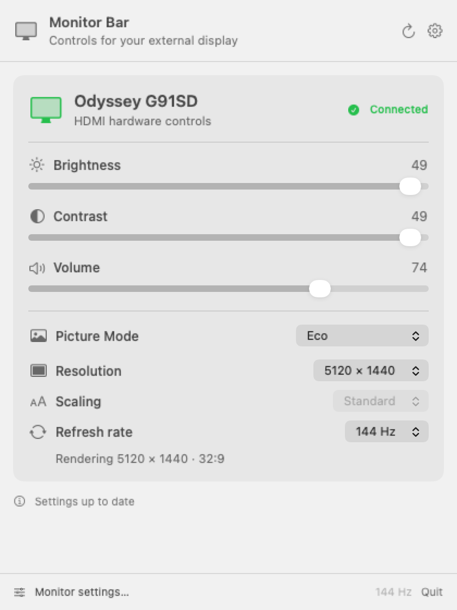

# Monitor Bar

The controls on the back of a monitor are rarely its best feature. Monitor Bar puts brightness, contrast, volume, and display modes in the Mac menu bar, where they're easier to reach.

[](https://github.com/aiden0rchad/monitor-bar/releases/latest)
[](https://github.com/aiden0rchad/monitor-bar/actions/workflows/ci.yml)
[](LICENSE)
[](https://aiden0rchad.github.io/monitor-bar/)

It's a small, free macOS app built with SwiftUI and AppKit. No account or subscription. The source is available under the [MIT license](LICENSE).

**[Download v0.1.1](https://github.com/aiden0rchad/monitor-bar/releases/tag/v0.1.1)** · **[Documentation](https://aiden0rchad.github.io/monitor-bar/)** · **[Report a problem](https://github.com/aiden0rchad/monitor-bar/issues/new/choose)**

Samsung G91SD hardware controls require individual verification and start disabled on a new installation. [See the current limits below](#samsung-odyssey-g91sd-over-hdmi).

<picture>
  <source media="(prefers-color-scheme: dark)" srcset="docs/assets/monitor-panel-dark.png">
  
</picture>

*The app's actual panel, rendered with sample display data.*

## Install

1. Download **Monitor-Bar-0.1.1-arm64.zip** from the [release page](https://github.com/aiden0rchad/monitor-bar/releases/tag/v0.1.1).
2. Unzip it and move **Monitor Bar.app** to Applications.
3. Open it, then click the monitor icon in the menu bar. There isn't a Dock window to look for.

You'll need an **Apple Silicon Mac running macOS 13 or later**. Hardware controls also need a monitor and cable connection that pass DDC/CI commands. A USB-C connector by itself doesn't guarantee support.

This release is ad-hoc signed, **not notarized by Apple**. If macOS blocks it, attempt to open it once, then use **System Settings → Privacy & Security → Open Anyway** if you choose to trust it. Apple's [instructions for opening downloaded apps](https://support.apple.com/en-us/102445) explain the prompts. You can also build from source below.

The release includes `SHA256SUMS` so you can check the download:

```sh
shasum -a 256 -c SHA256SUMS
```

Run that from the folder containing both the ZIP and `SHA256SUMS`.

## What it does

- Adjusts hardware brightness, contrast, and volume when the monitor supports them.
- Offers separate brightness and contrast calibration for monitors with odd control ranges.
- Lists the modes macOS exposes, with HiDPI labels, refresh rates, rendering pixels, and aspect ratios.
- Previews a resolution change for 15 seconds. Keep it, or let it revert.
- Exposes supported color settings, inputs, and standby under **More controls**.
- Provides software dimming when you want to darken the image further.
- Shows EDID and DDC details, and exports a local diagnostic report.
- Pauses all hardware commands when requested, keeping that pause across launches.
- Can launch at login. Use the gear menu to turn that on.

Controls with missing or unusable replies stay unavailable. A valid reply is still only a candidate for control: it does not guarantee that the monitor will handle adjustments safely. If the screen flashes or disconnects, quit the app and use the monitor's physical controls.

## Samsung Odyssey G91SD over HDMI

Version **0.1.1** adds seven hardware sliders for an individually verified G91SD: brightness, contrast, sharpness, red gain, green gain, blue gain, and volume. It also offers a **Picture Mode** picker for a separately verified unit in PC mode. Testing used firmware 1003.2 and direct HDMI on an M3 Max Mac, with changes checked against the monitor's own menu. This is one tested setup, not a compatibility claim for every G91SD.

<picture>
  <source media="(prefers-color-scheme: dark)" srcset="docs/assets/samsung-panel-dark.png">
  
</picture>

*Offline preview using sample Samsung data. Hardware controls require local verification.*

Enablement is saved locally for the individual monitor after verification. A matching model name alone does not enable hardware control, and no monitor's private identity is bundled with the app. The Samsung must be the Mac's only external display; the built-in screen can stay on. Connecting another external display disables hardware discovery for both. **Resume hardware controls** explicitly accepts the current HDMI connection for a previously verified Samsung; reconnection alone does not resume it.

There is no automatic verification or first-use enable button in this release. On a new installation, the Samsung's hardware controls remain unavailable while macOS resolution selection still works. To help test another unit, [open a compatibility report](https://github.com/aiden0rchad/monitor-bar/issues/new/choose) with the model, firmware, Mac, and connection details.

Samsung sliders apply when released. Before writing, the app reads the current value and refuses the change if it no longer matches the slider's starting value. It then sends one write and one readback, using the verified DDC packet format without retries. A refresh reads at most nine values: the seven slider controls, PC/AV mode, and Picture Mode. The app matches the HDMI service using cached macOS identity information, without a capabilities request or deep scan. A transport failure or connection change pauses further hardware commands until an explicit resume.

The sliders use OSD units: **0–50** for brightness and contrast, **0–20** for sharpness, and **0–100** for volume, following the monitor's reported ranges. RGB gains under **More controls** subtract 50 for display when the reported maximum is 100: a raw reply of 51 was confirmed as **+1**. That observation is not a calibration of the full color range. The OSD's separate **Color** setting is not an RGB gain control.

Picture Mode changes the monitor's hardware preset and can also change brightness, contrast, and color settings. The app refreshes its sliders afterward. The ten PC choices come from static analysis of Samsung's official Display Manager app and comparison with the OSD; direct HDMI tests have confirmed **Eco** and **Original**. See the [mode table and limits](https://aiden0rchad.github.io/monitor-bar/troubleshooting/#samsung-picture-mode).

If brightness is unavailable in the monitor's own menu, check **Save Power** first. Turning it off restored brightness on the tested unit. Firmware 1003.2 did not establish a general fix for HDMI disconnections. See [Samsung troubleshooting](https://aiden0rchad.github.io/monitor-bar/troubleshooting/#samsung-g91sd-hardware-controls).

## A note about brightness and contrast

This project started with a generic USB-C display that reported a normal 0–100 brightness range. In practice, moving through that range made the screen get brighter, then darker, then brighter again. The number returned by the monitor was correct; the picture wasn't behaving like that number suggested.

The working brightness range on that screen was roughly **0–25**. Calibration maps the full slider onto that smaller range. Contrast has an independent calibration for the same kind of problem.

Open **More controls → Brightness calibration** or **Contrast calibration**, enable **Use custom range**, and set the maximum hardware value. A maximum of 25 gives 26 hardware levels, shown in roughly 4% steps. If the control starts reversing near the top, lower the endpoint a little.

**On other monitors, fresh installs use the advertised range.** The value 25 is an example from one display, not a preset applied to every monitor. Calibration is saved separately for each control and monitor. The Samsung controls above use OSD units and hide these custom-range controls. [The controls guide](https://aiden0rchad.github.io/monitor-bar/controls/) covers the details.

## HiDPI and blurry text

A HiDPI mode separates the size of your workspace from the number of pixels used to draw it. For example, a 1280 × 800 workspace can render at 2560 × 1600 for sharper text.

Monitor Bar shows both numbers. It also compares the monitor's preferred timing with the mode macOS marks as native, because those can disagree on generic displays. When they do, try the available HiDPI options and keep the one with sharp text and correct proportions.

Only modes exposed by macOS are offered. There are no forced resolutions or system EDID overrides. See [HiDPI and resolutions](https://aiden0rchad.github.io/monitor-bar/hidpi/).

## Build it yourself

On an Apple Silicon Mac, install Apple's Command Line Tools if needed:

```sh
xcode-select --install
```

Then:

```sh
git clone https://github.com/aiden0rchad/monitor-bar.git
cd monitor-bar
./scripts/build.sh
open "build/Monitor Bar.app"
```

There are no third-party app dependencies. The build uses `swiftc`, `clang`, system frameworks, and local ad-hoc signing. The bundle identifier is `local.monitorbar.app`; keeping it stable preserves preferences when updating.

```sh
./scripts/test.sh       # Offline checks; no monitor settings are changed.
./scripts/preview.sh    # Render the panel using the included sample data.
./scripts/release.sh    # Package the app and checksums in dist/.
```

The [development guide](https://aiden0rchad.github.io/monitor-bar/development/) explains the source layout, diagnostic CLI, and opt-in hardware tests.

## Before reporting a problem

Monitor Bar is still an early project. Hardware testing covers an M3 Max Mac with a generic USB-C monitor and the Samsung HDMI setup described above. The app targets macOS 13 and later; the local hardware checks were run on macOS 26. An Intel build is not included.

DDC support varies by monitor, adapter, dock, and connection. Some screens ignore commands in certain picture modes. Others report values that don't match what you see. The app uses private `IOAVService` APIs for Apple Silicon DDC access, so a future macOS update may require changes.

If something doesn't work, include your Mac and macOS version, monitor model if known, cable or dock, and what happened at a few specific slider positions. **Please review diagnostic files before posting them**: they can contain the display serial, raw EDID, and registry paths. [Troubleshooting](https://aiden0rchad.github.io/monitor-bar/troubleshooting/) is a good place to start.

## Privacy and credits

The app has no analytics, account system, or network service. Settings and exported reports stay on your Mac unless you share them. The documentation and downloads are hosted by GitHub; visiting those pages is separate from running the app.

The compact panel takes visual inspiration from [WhatCable](https://github.com/darrylmorley/whatcable). No WhatCable source or artwork is bundled. DDC research references are kept in [DDCBridge.c](Sources/DDCBridge.c), including [MonitorControl](https://github.com/MonitorControl/MonitorControl), [ddcutil](https://github.com/rockowitz/ddcutil), and [Alin Panaitiu's IOAVService notes](https://notes.alinpanaitiu.com/Decoding-monitor-EDID-on-macOS).

Bug reports, monitor compatibility notes, and small, focused pull requests are welcome. See [CONTRIBUTING.md](CONTRIBUTING.md). The [to-do list](TODO.md) tracks upcoming hardware controls and the checks needed before adding them.
